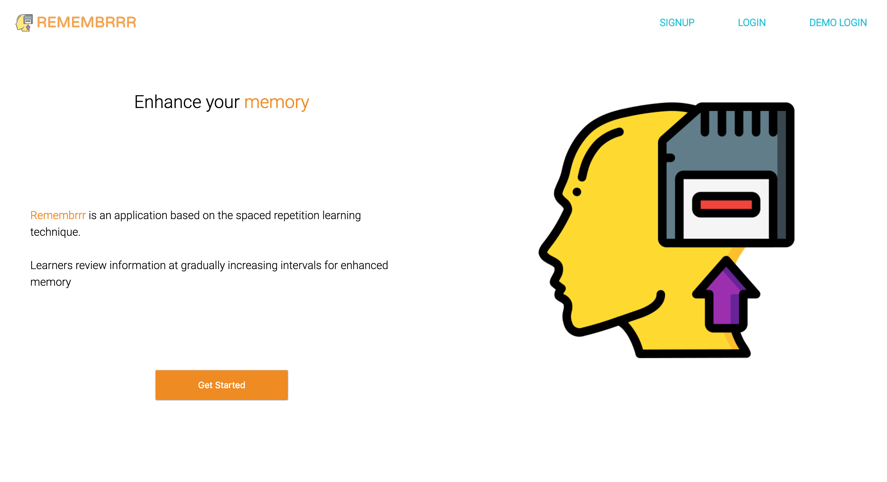
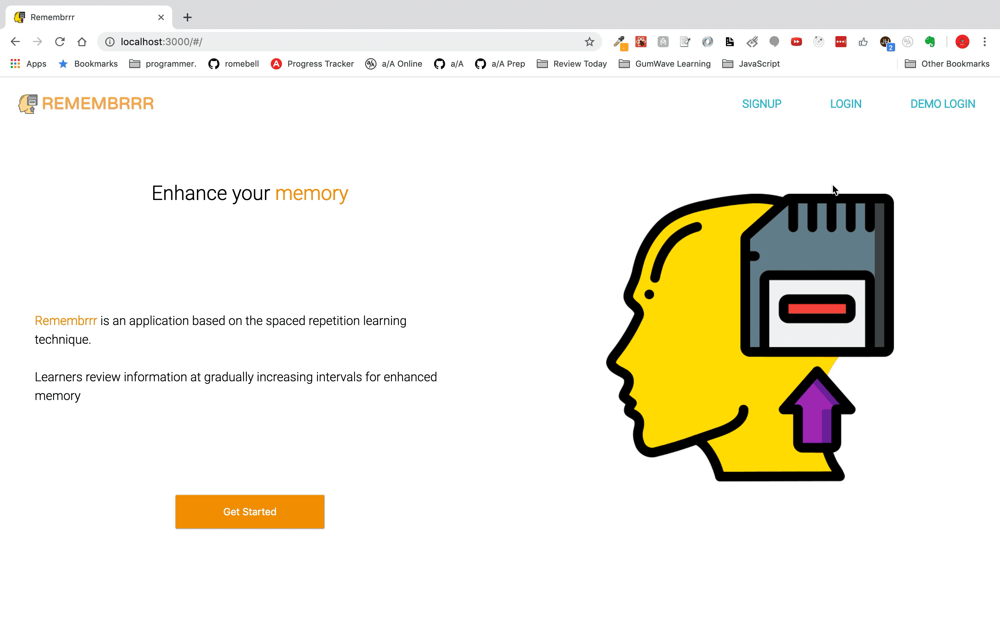

# Remembrrr

[Live Link](https://remembrrr.herokuapp.com/#/)

## Background & Overview

Remembrrr is a demo spaced repetition website that provides a user with a plateform to where they can create notes in the form of flashcards and be reminded to review those at a later time to avoid forgetting the material. With Remembrrr you will be able to never forget anything you want to remember.

The spaced repeition algorithm, founded by Dr Piotr Wozniak, will remind on a day right before your brain will forget the material to review it again.

## Technologies

`HTML5` / `SCSS` / `MongoDB` / `Express.js` / `React.js` / `Redux` / `Node.js` / `JavaScript`

## Features
Remembrrr Homepage

### User login displays all of the notes that were made and a new button to where a user can add a note to their collection of notes.

### User create a note, view the question and answer side, and deleting the note.

Employees and Managers can both record a call or a conversation

## Possible Future Implementations
+ Implement the spaced repetition algoritmn to where it gives you a notification when you log in to view notes for that day.
+ Make the web app a chrome extension as well that users can download and install on their chrome browser to quickly review notes and see notifications.

## Team Members	
Rome Bell, Kyle Fischer, Ahmed Ali